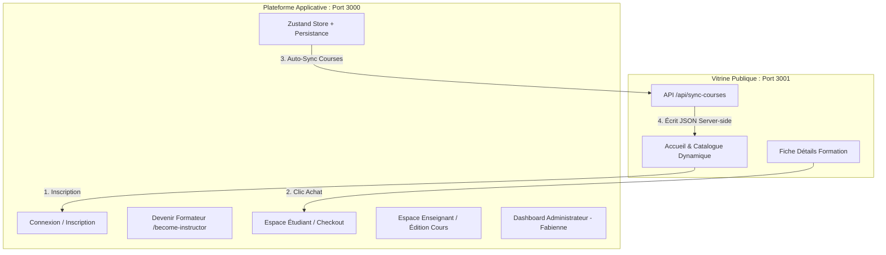

# 🌟 Template Global Workspace : Mindfulness Studio & Académie App

Bienvenue dans ce workspace de développement global. Ce dossier regroupe un écosystème complet de templates **Frontend** (React SPA, TanStack Start SSR) et **Backend** (Laravel, Sanctum, Fortify) conçus pour créer des plateformes e-learning, des vitrines haut de gamme et des tableaux de bord multi-rôles.

---

## 📁 Structure du Workspace

Voici la cartographie des différents projets présents dans ce dossier :

```
yemplate/
├── 🧘 f_mindfulness/                      # Vitrine marketing publique (TanStack Start - SSR, Port 3001)
├── ⚡ f_starter_dashboard_role_template/  # Plateforme applicative multi-rôles (React Vite SPA, Port 3000)
│                                         # (Espace étudiant, formateur, et administration de Fabienne)
├── 📱 app_mindfulness/                   # Application client additionnelle / Espace mobile React-like
├── 💻 f_dashboard_single_role_template/  # Template frontend alternatif de dashboard à rôle unique
│
├── 🐘 b_mindfulness/                     # Backend Laravel principal pour l'écosystème Mindfulness
├── 🐘 b_starter_dashboard_role_template/ # Backend Laravel dédié au template de dashboard multi-rôles
│
├── 🔑 auth_tanstack_start_ssr_with_sanctum/
│   ├── b_auth_tanstack_start_ssr_with_sanctum/ # Backend de démo d'authentification Sanctum
│   └── f_auth_tanstack_start_ssr_with_sanctum/ # Frontend TanStack Start relié à Sanctum
│
├── 🛡️ fortify_auth_multiple_guard/
│   ├── b_back/                            # Backend Laravel avec configuration multi-guards (Fortify)
│   └── app_front/                         # Frontend connecté avec authentification séparée
│
└── 📐 uxwireframe-main/                  # Dossier contenant les maquettes ou wireframes UX
```

---

## 🏗️ Zoom sur l'Écosystème Principal : Académie Mindfulness

Le duo **`f_mindfulness` (Vitrine)** + **`f_starter_dashboard_role_template` (Plateforme)** forme le cœur fonctionnel de l'application de formation.

### Architecture des Flux de l'Académie



### 🔄 Mécanisme de Synchronisation (Cross-Port)
Comme les deux applications tournent sur des ports différents (3000 et 3001), le navigateur isole leurs espaces `localStorage`. 
* **Flux de synchro** : Dès qu'un enseignant crée ou modifie un cours sur le **Port 3000**, le store Zustand déclenche un appel `POST` vers la vitrine (**Port 3001** via `/api/sync-courses`).
* **Base de données légère** : La vitrine écrit et charge en temps réel les données depuis `f_mindfulness/courses-db.json`.

---

## 👥 Les Rôles de la Plateforme (Port 3000)

1. **🎓 L'Élève (Client)** :
   * Parcourt la vitrine, achète un cours (redirection vers `/client/checkout/$courseId`).
   * Suit ses cours, ses leçons et remplit ses questionnaires de validation.
2. **🔮 Le Formateur (Instructor)** :
   * Postule via la page `/become-instructor`.
   * Crée des formations, ajoute des chapitres, définit les quiz et suit ses gains cumulés et le nombre d'élèves inscrits.
3. **👑 L'Administrateur (Fabienne)** :
   * Modère les candidatures d'instructeurs (`/admin/instructors`).
   * Visualise le tableau de bord financier, le taux de croissance des élèves, et les gains générés par chaque formateur de la plateforme.

---

## 🚀 Lancement Rapide (Mode Développement)

### 1. Lancer l'Application Principale (Port 3000)
```bash
cd f_starter_dashboard_role_template
npm install
npm run dev
```

### 2. Lancer la Vitrine (Port 3001)
```bash
cd f_mindfulness
npm install
npm run dev
```

### 3. Configurer les Backends Laravel (Optionnel)
Pour les dossiers `b_mindfulness` ou `b_starter_dashboard_role_template` :
```bash
cd b_mindfulness # ou b_starter_dashboard_role_template
composer install
cp .env.example .env
php artisan key:generate
php artisan migrate --seed
php artisan serve
```

---

## 💡 Notes de développement
* **Design** : Les pages partagent une charte premium sombre (Glassmorphism, dégradés vibrants et animations fluides).
* **Langue** : L'ensemble du contenu visible par les utilisateurs est rédigé en **Français**.
